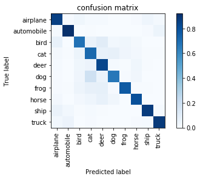
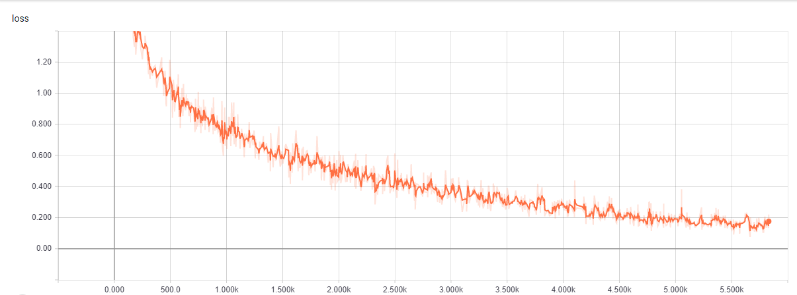

# 鄭欽安 <span style="color:red">(103061148)</span>

# Project 5: Deep Classification

## Overview
The project is related to using deep learning base method to implement a classifier on CIFAR-10 dataset.

## Implementation
* `dataloader.py`
    * Use pickle to load cifar-10 data

    ```python
    if mode == 'train':
        with open(os.path.join(data_path 'cifar10_train.pkl'), 'rb') as f:
            self.data = pickle.load(f)
    elif mode == 'test':
        with open(os.path.join(data_path, 'cifar10_test.pkl'), 'rb') as f:
            self.data = pickle.load(f)
    ```
    * Apply suffle function 
    ```python
    if is_shuffle:
        shuffle(self.idx_list)
    ```
    * Load batch function
    ```python
    #Imagenet mean and std
    mean = np.array([0.485, 0.456, 0.406])
    std= np.array([0.229, 0.224, 0.225])

    def load_batch(self, batch_size, idx):
        imgs = []
        labels = []
        if idx + batch_size >= self.total_length:
            cut_point = idx + batch_size - self.total_length + 1
            idx_list = self.idx_list[idx:-1] + self.idx_list[:cut_point]
            idx = cut_point
            self.epoch += 1
        else:
            idx_list = self.idx_list[idx:idx+batch_size]

        for data_idx in idx_list:
            img = self.data['images'][data_idx]
            label = self.data['labels'][data_idx]
            img = (img.astype('float32')/255 - mean)/std
            imgs.append(img)
            labels.append(label)
        idx = idx + batch_size
        imgs = np.asarray(imgs)
        labels = np.asarray(labels)

        return self.epoch, idx, imgs, labels    
    ```
    
* `model.py`
    * Model is base on resnet-18 structure, and make some change
    * Modify some convolution strides to fit 32x32 pixel
    * Add two Dropout keep rate = 0.5
    * Add L2 regularization at last fc layer
    * Data augmentation (left right random flip)
    ```python
     tf.map_fn(lambda img :tf.image.random_flip_left_right(img), x)
    ```
* `train.py`
    * Use softmax loss
    ```python
    tf.nn.softmax_cross_entropy_with_logits(labels=y_onehot, logits=logits)
    ```
    * Decay learning rate
    ```python
    learning_rate_start = 0.001
    learning_rate = tf.train.exponential_decay(learning_rate_start,
                                               global_step, 10000, 0.1)
    ```
    * Adam optimizer
    ```python
    optimizer = tf.train.AdamOptimizer(learning_rate=learning_rate)
	train_op = optimizer.minimize(loss, global_step=global_step)
    ```
    
* `test.py`
    * Restore model
    ```python
    restorer.restore(sess, tf.train.latest_checkpoint(model_path))
    ```
    * Accuracy 
    ```python
    prediction = tf.argmax(logits, axis=1)
	accuracy, accuracy_update = tf.metrics.accuracy(labels=y, predictions=prediction)
    ```
    * Confusion matrix
    ```python
    batch_confusion = tf.confusion_matrix(labels=y, 
                                    predictions=prediction, num_classes=10)
    ```

## Installation
* tensorflow 1.4.0
* pickle
* argparse

## Run
* Training
```
python train.py 
--data_path=./data
--model_path=./model
--batch_size=256
--epoch=30
--restore=False
```
* Testing
```
python test.py 
--data_path=./data
--model_path=./model
--batch_size=16
--data_mode=test
```
* Tensorboard
```
tensorboard --logdir=./graph
```
* Visualize confusion matrix
```
python visualize.py
--matrix_path=./confusion_matrix.npy
```


## Results

### Confusion Matrix  


  
### Loss
  

  
### Accuracy
* Training 30 epoch without ImageNet Pre-trained model
* Testing accuracy (top-1): 83.08%  
