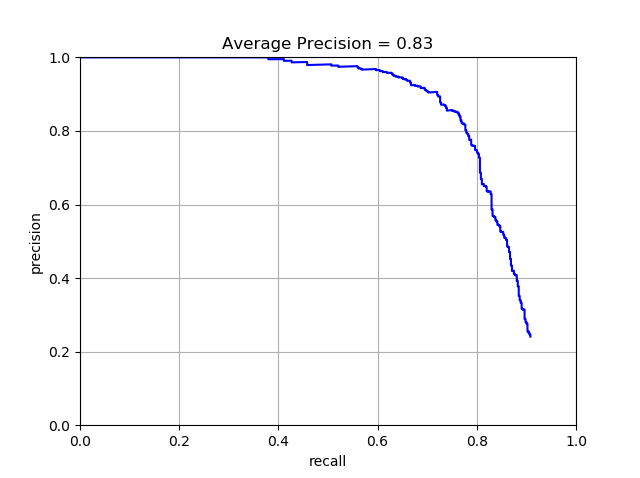
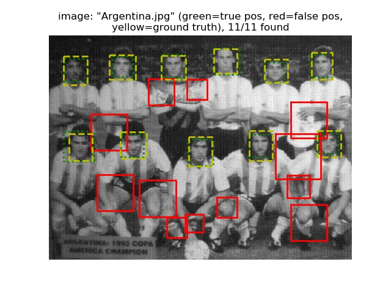
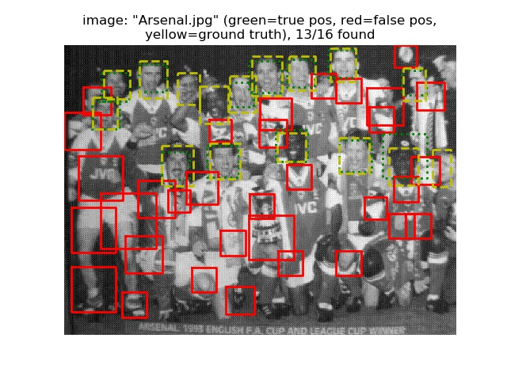
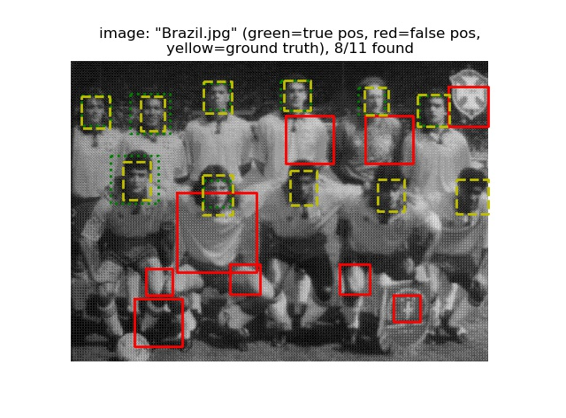
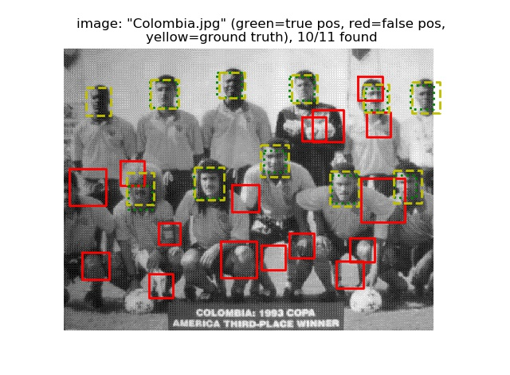
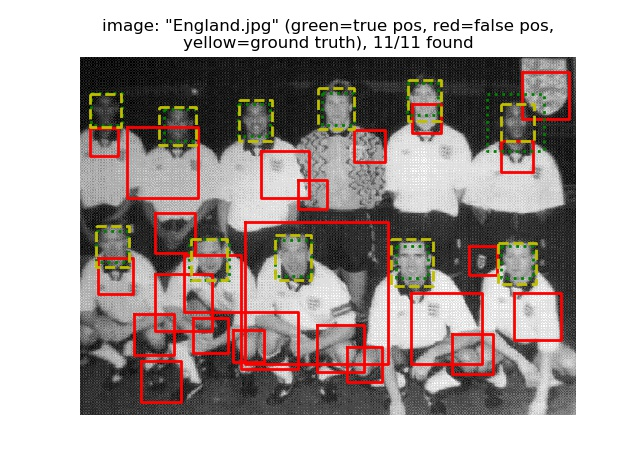
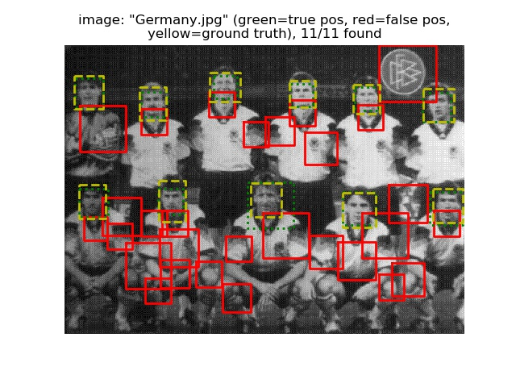
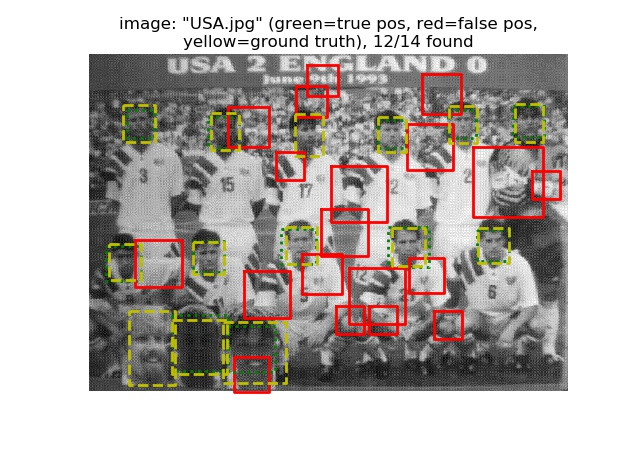

# 鄭欽安 <span style="color:red">(103061148)</span>

# Project 4 / Face Detection with a Sliding Window

## Overview
The project is related to do face detection by using linear SVM and sliding window method to classify HOG feature segments from images.

## Implementation
* **`get_positive_features.py`**
  
  * This function is to generate positive training data (with face)
  * Use os.listdir function to get all image path
  * Use hog function to convert image to hog features with hog cell size
```python
template_size = feature_params['template_size']
hog_cell_size = feature_params['hog_cell_size']
features_pos = []
print('Load positive features')

for image_path in tqdm(os.listdir(train_path_pos)):
    image_path = os.path.join(train_path_pos, image_path)
    im = imread(image_path)
    features_pos.append(np.reshape(hog(im, hog_cell_size), -1))
    features_pos = np.array(features_pos)
```
  
* **`get_random_negative_features.py`**  
  * This function is to generate negative training data (without face)
  * Read image with grey-scale
  * Use pyramid_gaussian function to build training data with different scale
  * Use sliding window method to build more templates  

```python
template_size = feature_params['template_size']
hog_cell_size = feature_params['hog_cell_size']
features_neg = []
images_path = []
print('Load negative features')
for image_path in os.listdir(non_face_scn_path):
    if image_path.find('.jpg') != -1:
        image_path = os.path.join(non_face_scn_path, image_path)
    images_path.append(image_path)

for image_path in tqdm(images_path):
    im = imread(image_path, as_grey=True)
    im_pyramids = tuple(pyramid_gaussian(im))
    for im_pyramid in im_pyramids[:1]:
      num_sample_per_image =  math.ceil(num_samples/len(images_path))
      if min(im_pyramid.shape[0], im_pyramid.shape[1]) <= template_size:
        break
      elif min(im_pyramid.shape[0], im_pyramid.shape[1]) < template_size + num_sample_per_image:
        num_sample_per_image =  min(im_pyramid.shape[0], im_pyramid.shape[1])-template_size 
      height_list = np.random.choice(im_pyramid.shape[0]-template_size, num_sample_per_image, replace=False)
      weight_list = np.random.choice(im_pyramid.shape[1]-template_size, num_sample_per_image, replace=False)
      for height, weight in zip(height_list, weight_list):
         features_neg.append(np.reshape(hog(im_pyramid[height:height+template_size, weight:weight+template_size], hog_cell_size), -1))

features_neg = np.array(features_neg)
```
  
* **`svm_classify.py`**    
  * This function is to build a linear SVM model for classification  
  
```python
clf = svm.LinearSVC()
clf.fit(x, y)
```

* **`run_detector.py`**
  * This function is to detect face on testing image set
  * Detect face on different image scale = [0.1 ~ 1.0]
  * Apply sliding window method on hog features 
  * Set threshold = -0.5, just store higher score examples
  * Finally, apply NMS to remove bounding boxes which were overlap
  
```python
cur_bboxes = np.zeros([0, 4])
cur_confidences = np.zeros([0, 1])
cur_image_ids = np.zeros([0, 1])

image_path = os.path.join(test_scn_path, test_images[i])
img = imread(image_path, as_grey=True)
scale_arr = np.arange(1.0, 0, -0.1)
for scale in scale_arr:
    img_resize = resize(img, [int(img.shape[0]*scale), int(img.shape[1]*scale)])
    test_image_hog = hog(img_resize, cell_size)
    for h in range(test_image_hog.shape[0]-cell_num+1):
	for w in range(test_image_hog.shape[1]-cell_num+1):
	    hog_window = np.reshape(test_image_hog[h:h+cell_num, w:w+cell_num, :], (1, -1))
	    score = model.decision_function(hog_window)
	    if score > -0.5:
		min_y = int(h*cell_size/scale)
		min_x = int(w*cell_size/scale)
		max_y = int((h+cell_num)*cell_size/scale)
		max_x = int((w+cell_num)*cell_size/scale)

		cur_confidence = np.array([score])
		cur_image_id = np.array([[test_images[i]]])
		cur_bbox = np.array([[min_x, min_y, max_x, max_y]])

		cur_bboxes = np.concatenate([cur_bboxes, cur_bbox], 0)
		cur_confidences = np.concatenate([cur_confidences, cur_confidence], 0)
		cur_image_ids = np.concatenate([cur_image_ids, cur_image_id], 0)
```

## Installation
* Package
  * skimage
  * cyvlfeat
  * tqdm
  * sklearn
   
* Run  
`python proj4.py`

### Results

<center>
Precision Recall curve.
<p>

<p>
<table border=1>
<tr>
<td>




</td>
</tr>

<tr>
<td>




</td>
</tr>

</table>


</center>
