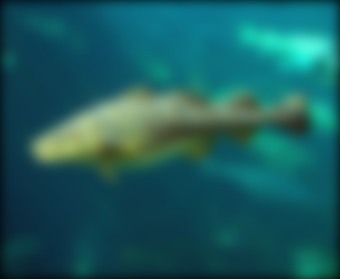
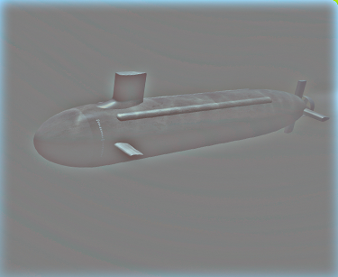
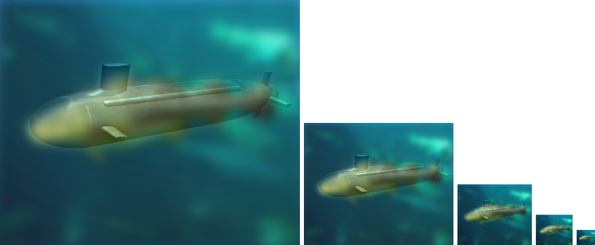
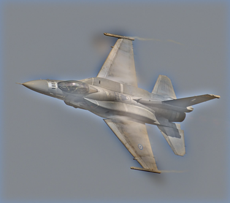
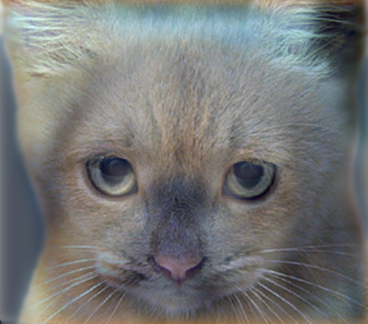
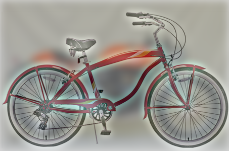

# 鄭欽安 <span style="color:red"> (103061148) </span>

# Project 1 / Image Filtering and Hybrid Images

## Overview
The project is related to Image Filtering and Hybrid Images. It's implemented by combining low frequecy part from one image and high frequency part from another image. Low frequency part represents the base colors and shapes of image and high frequency represents the detail of image. We will use gaussian filter to get low frequency part and origin image substract low frequency part to get high frequency part, then generate hybrid image.


## Implementation
  
### 1. Imfilter
1. Convolution padding  
* Calculate the number of padding pixels 
* Generate the same image with padding 0 by np.lib.pad function.    
  
```
    pad_x = (imfilter.shape[0] - 1) / 2
    pad_y = (imfilter.shape[1] - 1) / 2
    for ch in range(image.shape[2]):
        image_pad = np.lib.pad(image[:, :, ch], ((pad_x, pad_x), (pad_y, pad_y)), 'constant', constant_values=(0, 0))
```
2. Convolution  
* Do convolution on padding image, we will get same size output image as input image.  
* Convolution is implemented by for loop and numpy element-wise multiply function.  
```
 for ch in range(image.shape[2]):
     for i in range(output.shape[0]):
         for j in range(output.shape[1]):
             output[i, j, ch] = np.sum(np.multiply(image_pad[i:i+imfilter.shape[0], j:j+imfilter.shape[1]], imfilter))
```
### 2. Hibird image generation  
* Do gaussian filter convolution to get image1 low frequency part (base).  
* Do laplace filter convolution (origin image substract the result of gaussian) to get image2 high frequency part (detial).  
* Finally, we will get hybrid images result by combining the low frequency part of image1 and high frequency part of image2.     
```
low_frequencies = my_imfilter(image1, gaussian_filter)
high_frequencies = image2 - my_imfilter(image2, gaussian_filter)
hybrid_image = normalize(low_frequencies + high_frequencies)
```  

### Testing
```
python proj1_test_filtering.py
```
```
python proj1.py
```  
  
### Results
* Low frequency result of bird image by using gussian filter  
<p>   </p> 
  
* High frequency result of plane image by using origin image substract gussian result method
<p>   </p>   
  
* Hybrid image (the result of combining low frequency part and high frequency part)
<p>  </p>
  
* Other examples of hybrid images
  
|Bird and Plane | Dog and Cat | Motorcycle and Bicycle|  
|----|----|----|  
| <p align='center'></p> | <p align='center'></p> | <p align='center'></p> |

