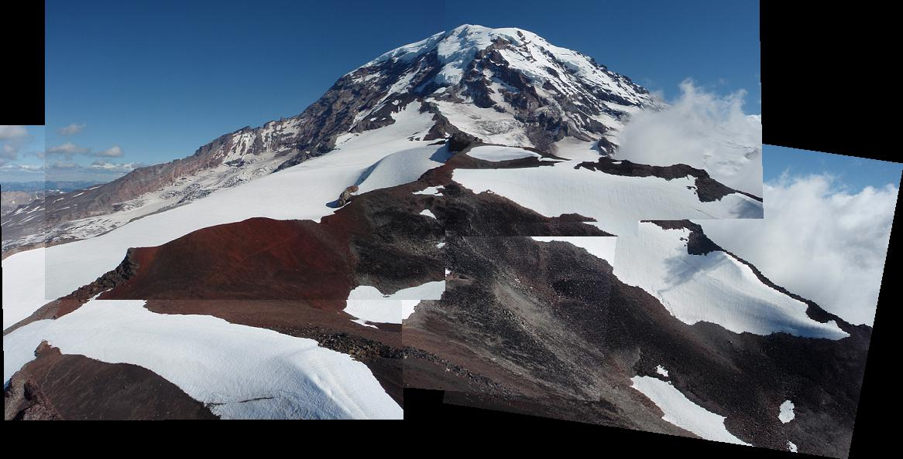
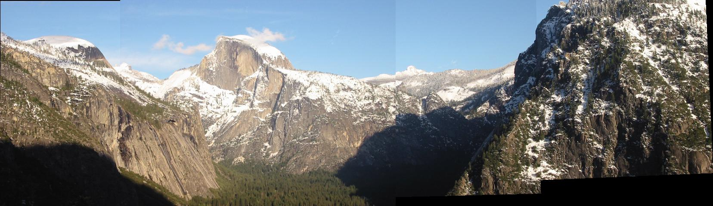
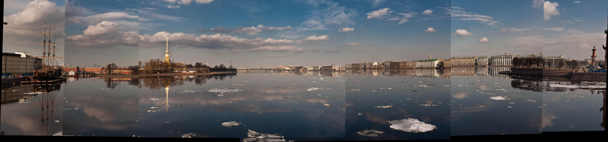

# 鄭欽安 <span style="color:red"> (103061148) </span>

# Project 2 / Panorama Stitching

## Overview
The project is related to Panorama Stitching. We will match SIFT keypoints from multiple images and compute transformation matrix between multiple images to build a single panoramic image.  


## Implementation
* Use vlfeat SIFT funtion to find 128 dimensions SIFT descriptor of each keypoint in image.

* Compare SIFT descriptors between the points of two images we would like to merge, and detemine whether they are matched.    
  * Calculate the Euclidean distance between a given SIFT descriptor from image1 and all SIFT descriptors from image2.
  * If it satisfies that [smallest Euclidean distance = THRESH * second smallest Euclidean distance], we will call it match and record the index of two points.
  * Repeat above steps until completeing every points in image 1.
  * Use np.tile() and matrix multiply to reduce computing time.  
  
```python
match = []
    for i in range(len(descriptor1)):
        distance = []
        d1_repeat = np.tile(descriptor1[i], (len(descriptor2), 1))
        distance = np.sqrt(np.sum((d1_repeat - descriptor2)**2, axis=1))
        distance_sorted = np.sort(distance)
        if distance_sorted[0] < THRESH*distance_sorted[1]:
            match.append([i, np.argmin(distance)])

match = np.array(match)
```
  
* When we get match points from image1 and image2, we could compute the affine transformation matrix which maps the positions from image1 to positions in image2.  
```python
H = np.linalg.lstsq(P1.T, P2.T)[0].T
```
  
* Use RANSAC to find more robust estimate of affine transformation matrix, we just need to modify ComputeError function.
```python
dists = []
    
    for i in range(len(match)):
        p1_point = np.concatenate([pt1[match[i,0],:], [1]])
        p2_point = np.concatenate([pt2[match[i,1],:], [1]])
        dists.append(np.sqrt(np.sum((np.matmul(H, p1_point) - p2_point)**2)))
    dists = np.array(dists)
```  
  
* If we would like to stitching multiple images, we need to construct a matrix which will convert the given frame into the given reference frame with an ordered sequence transformation matrix list.   
```python
T = np.eye(3)
    if currentFrameIndex < refFrameIndex:
        for i in range(currentFrameIndex, refFrameIndex):
            T = np.matmul(i_To_iPlusOne_Transform[i], T) 
    else:
        for i in range(currentFrameIndex, refFrameIndex, -1):
            T = np.matmul(np.linalg.pinv(i_To_iPlusOne_Transform[i-1]), T)
```
  
* After completing above steps, we can stitch multiple images by running code.
```
python StitchTester.py 
```
## Installation
* Anaconda python 3.6
  
*  cyvlfeat
```
conda install -c menpo cyvlfeat
```
* Pillow 4.1.1
```
pip install Pillow==4.1.1
```
 

## Results

||Image|
|------|------|
|TA's images (Rainier)| <p align='center'> </p>|
|TA's images (yosemite)|<p align='center'> </p>|
|My images (boat)| <p align='center'> </p>|
