# 鄭欽安 <span style="color:red"> (103061148) </span>

# Project 3 / Scene recognition with bag of words

## Overview
The project is related to Scene recognition. This task could be separated to two differnet parts: **Feature extracter and Classifier.** About Feature extracter, we will implement **Tiny Image representation** and **Bag of SIFT representation** to get image feature. About Classifier, we will implement **K-Nearest Neighbor** and **Support Vector Machine** to do classification.     


## Implementation
### Feature extracter
* **Tiny Image representation**
    * Extract image features by resizing each image to 16x16 resolution
    * Apply normalization on them
    * Reshape to vector for each image 
    ```python
    tiny_images = []
    for image_path in image_paths:
        im = Image.open(image_path)
        im = np.array(im.resize((16, 16), Image.BILINEAR))
        im = im - np.mean(im)
        norm = np.linalg.norm(im)
        if norm != 0:
            im = im/norm

        tiny_images.append(im.reshape(-1))
    tiny_images = np.array(tiny_images)
    ```
* **Bag of SIFT representation**
    * **Build vocabulary**
        * Apply SIFT on training data to get SIFT features.
        * Use Kmeans algorithm to cluster them in K (vocabulary size) regions for building vocabulary.
    ```python
    bag_of_features = []
    for path in image_paths:
        img = np.asarray(Image.open(path),dtype='float32')
        frames, descriptors = dsift(img, step=[5,5], fast=True)
        bag_of_features.append(descriptors)
    bag_of_features = np.concatenate(bag_of_features, axis=0).astype('float32')
    vocab = kmeans(bag_of_features, vocab_size, initialization="PLUSPLUS")        
    ```
    * **Get Bag of SIFT representation**
        * Apply SIFT on input images to get SIFT features.
        * Compare input STFT features to vocabulary STFT features and find the minimum distance from each culsters. Then assign input to its nearest cluster of vocabulary.
        * Use histogram to count how many times each cluster was used
        *  Apply normalization on them
    ```python
    with open('vocab.pkl', 'rb') as handle:
        vocab = pickle.load(handle)
    image_feats = []
    for path in image_paths:
        img = np.asarray(Image.open(path),dtype='float32')
        frames, descriptors = dsift(img, step=[5,5], fast=True)
        dist = distance.cdist(vocab, descriptors)
        feat = np.argmin(dist, axis=0)
        feat, bin_edges = np.histogram(feat, bins=range(0, len(vocab)+1))
        norm = np.linalg.norm(feat)
        if norm != 0:
            feat = feat/norm
        image_feats.append(feat)
    image_feats = np.array(image_feats)
    ```
### Classifier
* **K Nearest Neighbor (KNN)**
    * To find which training image feature is closer to testing image feature by calculating distance between them
    * Use voting with top K candidate 
    ```python
    k = 5 
    dict_ = defaultdict(int)
    distance_feats = distance.cdist(test_image_feats, train_image_feats)
    test_predicts = []
    k_idx_lists = np.argsort(distance_feats)[:,:k]
    for k_idx_list in k_idx_lists:
        labels = [ train_labels[idx] for idx in k_idx_list]
        for label in labels:
            dict_[label] += 1
        test_predicts.append(max(dict_.items(), key=operator.itemgetter(1))[0])
        dict_.clear()
    ```
* **Linear Support Vector Machine (SVM)**
    * Apply linear Support Vector Machine to fit training data
    * Use that model for testing prediction
    ```python
    clf = LinearSVC(random_state=0, c=1.0)
    clf.fit(train_image_feats, train_labels)
    pred_label = clf.predict(test_image_feats)
    ```
### Extra
* Try different vocabulary size, such as 100, 400, 1000.
* Non linear SVM
    ```python
    from sklearn.svm import SVC
    clf = SVC(random_state=0, C=1, kernel='rbf')
    clf.fit(train_image_feats, train_labels)
    pred_label = clf.predict(test_image_feats)
    ```

## Installation
* cyvlfeat
```
conda install -c menpo cyvlfeat
```
### Run
```
python proj3.py --feature={tiny_image, bag_of_sift} --classifier={nearest_neighbor, support_vector_machine}
```
## Result
* **K Nearest Neighbor**

||Tiny Image representation|Bag of SIFT representation|
|----|----|----|
|k=1|22.4%|55.33%|
|k=3|22.73%|56.6%|
|k=5|21.8%|56.8%|
|k=7|22.45%|56.53%|

* **Linear Support Vector Machine**

||Tiny Image representation|Bag of SIFT representation|
|----|----|----|
|c=0.01|21.67%|54.13%|
|c=0.1|22.73%|65.6%|
|c=1|21.26%|71.06%|
|c=10|17.87%|69.2%|
|c=100|15.47%|67.2%|

* **Different Vocabulary size (Extra)**
    * Apply KNN and set K = 5
    * Apply Linear SVM and set C = 1

||KNN|Linear SVM|
|----|----|----|
|Vocabulary size = 100|54.2%|65.73%|
|Vocabulary size = 400|56.8%|71.06%|
|Vocabulary size = 1000|56.4%|72.8%|


* **Nonlinear SVM (kernel = rbf) (Extra)**
    * Vocabulary size = 1000
        
||Bag of SIFT representation|
|---|---|
|c=1000|72.33%|

### Confusion matrix


### Visualization
| Category name | Sample training images | Sample true positives | False positives with true label | False negatives with wrong predicted label |
| :-----------: | :--------------------: | :-------------------: | :-----------------------------: | :----------------------------------------: |
| Kitchen |  |  |  | 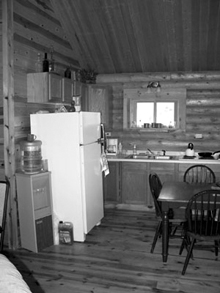 |
| Store |  | 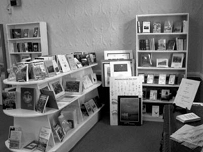 |  | 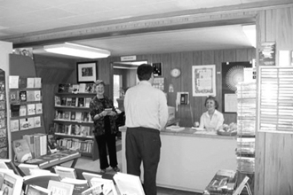 |
| Bedroom | 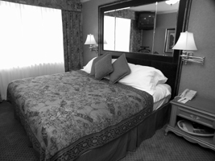 |  |  |  |
| LivingRoom |  |  |  |  |
| Office |  |  | 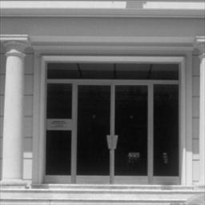 |  |
| Industrial |  |  | 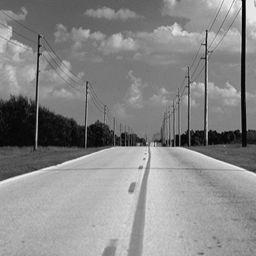 |  |
| Suburb | 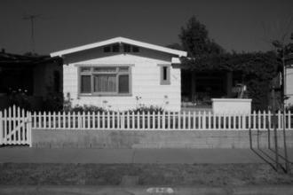 |  | 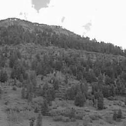 |  |
| InsideCity | 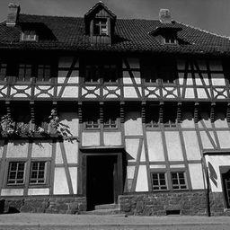 |  |  |  |
| TallBuilding |  |  | 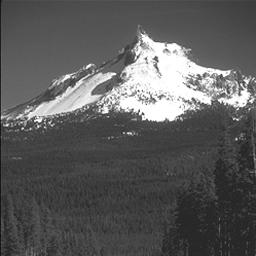 |  |
| Street | 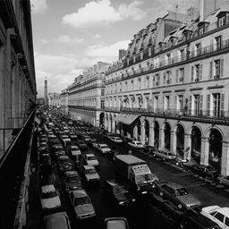 |  |  |  |
| Highway |  |  |  |  |
| OpenCountry |  |  |  |  |
| Coast |  |  |  |  |
| Mountain |  |  |  |  |
| Forest |  | 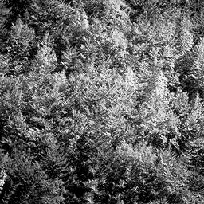 | 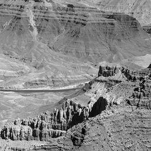 |  |

